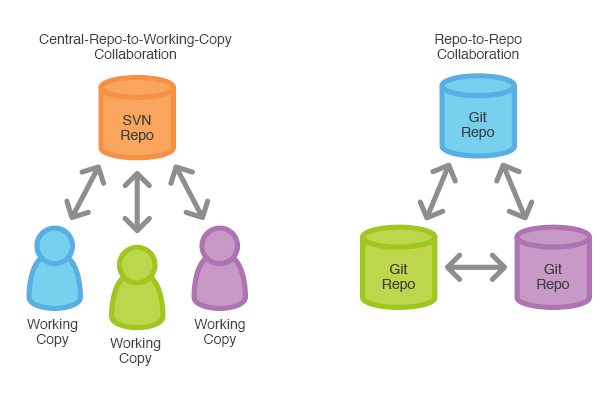

# 1. Introducción a Git y GitLab

- [Fundamentos del control de versiones](#fundamentos-del-control-de-versiones)
- [Conceptos básicos de Git](#conceptos-básicos-de-git)
- [Características principales de GitLab](#características-principales-de-gitlab)

## Fundamentos del Control de Versiones

El control de versiones es un sistema que permite registrar los cambios realizados en un archivo o conjunto de archivos a lo largo del tiempo.

Su principal objetivo es gestionar las modificaciones en el código fuente de un proyecto, facilitando la colaboración y evitando la pérdida de información.

### Beneficios Principales

- **Historial de cambios:** Permite acceder a versiones anteriores de los archivos y recuperar información en caso de errores.
- **Colaboración eficiente:** Varios desarrolladores pueden trabajar en el mismo proyecto sin sobrescribir el trabajo de otros.
- **Rastreo de modificaciones:** Se puede identificar quién hizo cada cambio y cuándo.
- **Ramas y versiones:** Facilita la experimentación y el desarrollo paralelo sin afectar la versión estable del proyecto.

## Conceptos Básicos de Git

Git es un sistema de control de versiones distribuido, lo que significa que cada desarrollador tiene una copia del historial completo del proyecto, incluyendo todos los cambios realizados.

Esto no implica necesariamente que tenga todos los archivos de todas las ramas en su sistema local, sino que cada uno puede tener solamente aquello que necesite o en lo que esté trabajando.

### Principales Conceptos

- **Repositorio:** Lugar donde se almacena el historial de cambios de un proyecto.
- **Commit:** Registro de cambios en el repositorio con un mensaje descriptivo.
- **Branch (rama):** Línea de desarrollo independiente para trabajar en nuevas funcionalidades sin afectar la versión principal.
- **Merge:** Integración de cambios de una rama a otra.
- **Pull y Push:** Descarga y subida de cambios desde/hacia un repositorio remoto.

## Características Principales de GitLab

GitLab es una plataforma de desarrollo colaborativo que proporciona herramientas para la gestión de repositorios Git, además de integración y despliegue continuo.

### Funcionalidades Clave

- **Repositorios remotos:** Permite almacenar código en la nube y compartirlo con equipos de trabajo.
- **Gestión de ramas y permisos:** Facilita la administración de usuarios y flujos de trabajo.
- **CI/CD integrado:** Permite automatizar pruebas y despliegues.
- **Seguimiento de incidencias:** Dispone de un sistema de gestión de tareas para organizar el desarrollo.
