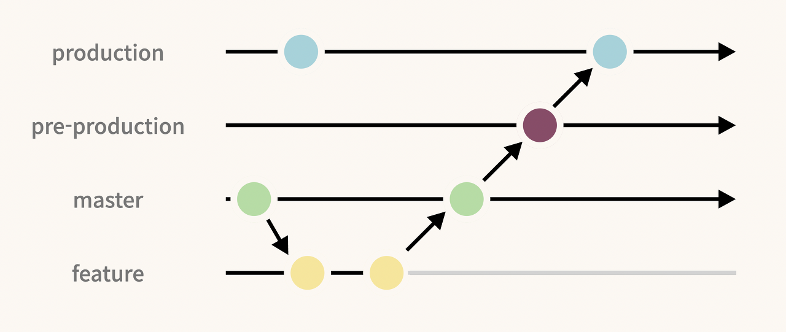
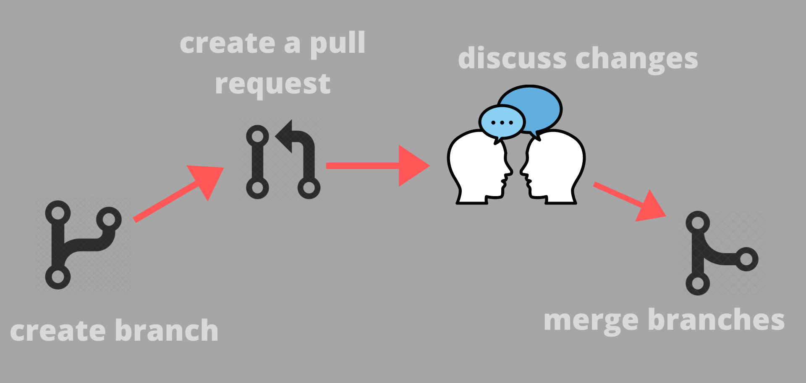

# 4. Flujos de trabajo en equipo

- [Flujos de trabajo basados en GitLab Flow](#flujos-de-trabajo-basados-en-gitlab-flow)
- [Uso de merge requests y revisión de código](#uso-de-merge-requests-y-revisión-de-código)
- [Gestión de issues y etiquetado](#gestión-de-issues-y-etiquetado)

## Flujos de trabajo basados en GitLab Flow

**GitLab Flow** es una metodología que permite estructurar el desarrollo de software con Git y GitLab, facilitando la colaboración y la integración continua.



### Principales enfoques de GitLab Flow

1. **Main Only**
   - Todos los cambios se hacen en `main` sin ramas de desarrollo.
   - Útil para proyectos pequeños sin necesidad de versiones.

2. **Feature Branches**
   - Se crean ramas para cada nueva funcionalidad (`feature/new-feature`).
   - Permite trabajo paralelo y revisiones antes de integrar en `main`.

3. **Environment Branches**
   - Se usan ramas para distintos entornos (`develop`, `staging`, `production`).
   - Útil en proyectos con despliegue continuo.

4. **Release Branches**
   - Se crean ramas para gestionar versiones (`release/v1.0`).
   - Permite estabilidad en producción y desarrollo simultáneo.

## Uso de Merge Requests y revisión de código

Las **Merge Requests** en GitLab permiten revisar y fusionar cambios de una rama a otra.



### Proceso de una Merge Request

1. **Crear una rama de trabajo**
   ```bash
   git checkout -b feature/new-functionality
   ```

2. **Realizar cambios y hacer commits**
   ```bash
   git add .
   git commit -m "Implementar nueva funcionalidad"
   ```

3. **Subir la rama al repositorio**
   ```bash
   git push origin feature/new-functionality
   ```

4. **Abrir una Merge Request en GitLab**
   - Ir a GitLab → Proyecto → *Merge Requests* → *New Merge Request*.
   - Seleccionar `source branch` (feature) y `target branch` (main o develop).
   - Escribir una descripción clara.

5. **Revisión de código**
   - Otros miembros revisan los cambios y comentan mejoras.
   - Se realizan correcciones si es necesario.

6. **Aprobación y fusión**
   - Una vez aprobado, se fusiona con `main`.

     ```bash
     git checkout main
     git merge feature/new-functionality
     git push origin main
     ```
   - También se puede hacer desde la interfaz de GitLab.

7. **Eliminar la rama después de la fusión**

   ```bash
   git branch -d feature/new-functionality
   git push origin --delete feature/new-functionality
   ```

## Gestión de Issues y Etiquetado

GitLab proporciona herramientas de gestión de tareas con **Issues** y **Labels**.

### Creación de un Issue

1. Ir a *Issues* → *New Issue*.
2. Escribir un título claro y una descripción detallada.
3. Asignarlo a un desarrollador.
4. Etiquetarlo según su categoría: `bug`, `functionality`, `critical`, etc.

### Uso de etiquetas (Labels)

- Ayudan a organizar los issues por prioridad o tipo.
- Ejemplos:
  - `bug`: Error en el código.
  - `functionality`: Nueva funcionalidad.
  - `critical`: Problema crítico.

### Relación entre Issues y Merge Requests

- Un Issue describe un problema o tarea.
- Una Merge Request proporciona la solución.
- En la descripción de la Merge Request, se puede referenciar un Issue con `Closes #123`.
- Al fusionar la Merge Request, el Issue se cierra automáticamente.
