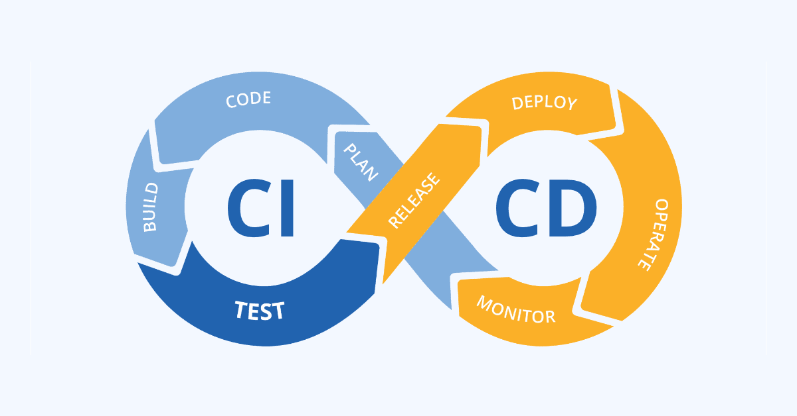

# 5. Automatización y CI/CD básico en GitLab

- [Introducción a pipelines en GitLab](#introducción-a-pipelines-en-gitlab)
- [Configuración básica de GitLab CI/CD](#configuración-básica-de-gitlab-cicd)
- [Integración de pruebas automáticas](#integración-de-pruebas-automáticas)

## Introducción a Pipelines en GitLab

Un **pipeline** en GitLab es una secuencia de tareas de integración y despliegue continuo que se ejecutan de forma automatizada en respuesta a eventos como commits o merges. Algunas de estas tareas pueden ser compilar, probar o desplegar código a producción, entre otras.



### Conceptos clave:

- **Jobs**: Tareas individuales dentro del pipeline (por ejemplo, ejecutar pruebas o desplegar código).
- **Stages**: Agrupaciones de jobs que se ejecutan en orden (por ejemplo, `build`, `test`, `deploy`).
- **Runners**: Servidores que ejecutan los jobs del pipeline. Pueden ser locales o en la nube.
- **gitlab-ci.yml**: Archivo donde se define la configuración del pipeline.

## Configuración básica de GitLab CI/CD

Para activar la integración continua en un proyecto de GitLab:

1. Crear un archivo `.gitlab-ci.yml` en la raíz del repositorio.
2. Definir al menos un job dentro del archivo, por ejemplo:

   ```yaml
   stages:
     - build
     - test

   build-job:
     stage: build
     script:
       - echo "Compilando el proyecto..."

   test-job:
     stage: test
     script:
       - echo "Ejecutando pruebas..."
   ```
3. Guardar y subir el archivo al repositorio:

   ```bash
   git add .gitlab-ci.yml
   git commit -m "Añadir configuración básica de CI/CD"
   git push origin main
   ```
4. GitLab ejecutará el pipeline automáticamente en cada push o merge.

## Integración de Pruebas Automáticas

Las pruebas automatizadas verifican que el código funcione correctamente antes de fusionarse con la rama principal.

Ejemplo de integración de pruebas en **Node.js** con `Jest`:

```yaml
stages:
  - test

test:
  stage: test
  image: node:18
  before_script:
    - npm install
  script:
    - npm test
```  

En este caso, GitLab usará una imagen de Docker con **Node.js 18**, instalará las dependencias definidas en `package.json` y ejecutará los tests con `npm test`.
